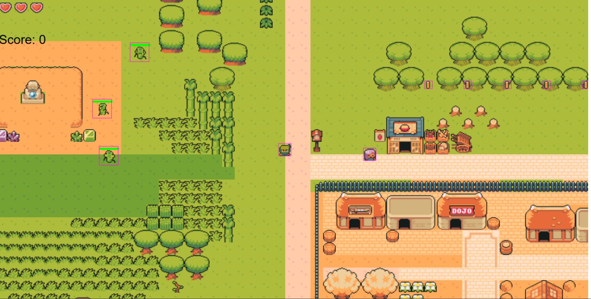

# 🥷 Ninja Town

<div align="center">

### A Fast-Paced 2D Arcade Evasion Game 🎮



**Master your reflexes • Escape the enemies • Collect the coins • Beat your high score**

[](https://ninja-town.onrender.com)
[](https://www.javascript.com/)
[](https://phaser.io/)
[](./LICENSE)

</div>

---

## 🎮 Game Overview

You are a **stealthy ninja** trapped in a hostile town where enemies are relentlessly hunting you down. Your mission is straightforward but challenging:

**Survive as long as possible while collecting gold coins to maximize your score.**

### The Challenge
- 🔴 Enemies actively track your movements to corner you
- ⚡ The longer you survive, the more aggressive the pursuit becomes  
- 💰 Coins are scattered throughout the town map
- 🏃 Speed, agility, and quick reflexes are your best weapons

---

## ✨ Features

- **Fluid Movement** - Smooth, responsive physics-based ninja controls (running, jumping, and dodging)
- **Dynamic Enemy AI** - Intelligent enemies that chase and hunt your position
- **Score System** - Track collected coins with persistent high score tracking
- **Retro Visuals** - Crisp 2D sprite artwork and pixel-art animations for classic arcade feel
- **Multiple Maps** - Navigate through different town layouts with unique challenges
- **Single Player & Multiplayer Modes** - Play solo or challenge the game field
- **Responsive Controls** - Optimized for keyboard input with smooth responsiveness
- **Web-Based** - Play instantly in any modern browser without installations

---

## 🚀 Quick Start

### Play Online
Visit **[https://ninja-town.onrender.com](https://ninja-town.onrender.com)** to play the live version right now!

### Play Locally

#### Prerequisites
- Node.js (v14 or higher)
- npm or yarn

#### Installation Steps

```bash
# Clone the repository
git clone https://github.com/vivekrqwat/Ninja_town.git
cd ninjaTown

# Install frontend dependencies
cd Frontend
npm install

# Start development server
npm run dev
```

The game will be available at `http://localhost:5173` (or the port shown in your terminal)

---

## 🎮 How to Play

### Controls
- **Arrow Keys** or **WASD** - Move your ninja character
- **Spacebar** - Jump over obstacles and enemies
- **Mouse** - Menu interactions (if applicable)

### Gameplay Tips
1. **Avoid Enemies** - Don't let enemies catch you! They grow more aggressive over time
2. **Collect Coins** - Grab gold coins scattered across the map for points
3. **Use Terrain** - Navigate smartly using the town's buildings and obstacles
4. **Stay Alert** - Multiple enemies can spawn; keep an eye on all directions
5. **Beat Your Score** - Try to survive longer and collect more coins each game

---

## 🛠️ Technology Stack

### Frontend
- **Phaser 3** - HTML5 game framework for game logic and rendering
- **JavaScript (ES6+)** - Core game logic and mechanics
- **HTML5 & CSS3** - UI and styling
- **Vite** - Modern build tool for fast development

### Backend
- **Node.js** - Server runtime
- **Express.js** (optional) - API server if needed

### Art & Assets
- **Tiled Map Editor** - Level/map design (.json, .tmj formats)
- **Pixel Art Sprites** - Retro visual style for characters and objects

---

## 📁 Project Structure

```
ninjaTown/
├── Frontend/                    # React/Vite frontend application
│   ├── src/
│   │   ├── GameResources/      # Game logic and assets
│   │   │   ├── GAMe.js         # Main game initialization
│   │   │   ├── GamePLay.jsx    # Game scene component
│   │   │   ├── Anims/          # Animation handlers
│   │   │   ├── Funtions/       # Game mechanics (character, damage, etc.)
│   │   │   ├── Maps/           # Tiled map files and tilesets
│   │   │   ├── NInja/          # Ninja character logic
│   │   │   ├── otherChar/      # Enemy and NPC characters
│   │   │   ├── Resources/      # Game assets (sprites, sounds)
│   │   │   └── Scenes/         # Game scenes (Start, Game, Restart)
│   │   ├── App.jsx
│   │   └── main.jsx
│   ├── package.json
│   └── vite.config.js
│
└── backend/                    # Backend server
    ├── index.js
    └── package.json
```

---

## 🎨 Game Scenes

- **StartScene** - Main menu and game introduction
- **Preload** - Asset preloading for smooth gameplay
- **GameField** - Multiplayer game field with enemies and coins
- **SinglePlayerGameField** - Solo adventure mode
- **Restart** - Game over screen with score and retry option

---

## 📦 Dependencies

### Key Libraries
- `phaser` - Game framework
- `react` - UI library
- `vite` - Build tool

See `package.json` for full dependency list.

---

## 🤝 Contributing

Contributions are welcome! Here's how you can help:

1. Fork the repository
2. Create your feature branch (`git checkout -b feature/AmazingFeature`)
3. Commit your changes (`git commit -m 'Add some AmazingFeature'`)
4. Push to the branch (`git push origin feature/AmazingFeature`)
5. Open a Pull Request

### Ideas for Contribution
- Add new enemy types with unique AI behaviors
- Create additional map layouts
- Implement power-ups and special abilities
- Add sound effects and background music
- Optimize performance for mobile devices
- Write unit tests for game mechanics

---

## 🐛 Known Issues & TODO

- [ ] Mobile touch controls
- [ ] Sound effects and background music
- [ ] Leaderboard system
- [ ] Difficulty settings
- [ ] Additional power-ups

---

## 📝 License

This project is licensed under the MIT License - see the LICENSE file for details.

---

## 👨‍💻 Author

**Vivek** - [GitHub Profile](https://github.com/vivekrqwat)

---

## 🙏 Acknowledgments

- [Phaser](https://phaser.io/) - Amazing game framework
- [Tiled](https://www.mapeditor.org/) - Level design tool
- All contributors and testers who help improve the game

---

## 📞 Support

Have questions or found a bug? 
- Open an [Issue](https://github.com/vivekrqwat/Ninja_town/issues)
- Check existing [Discussions](https://github.com/vivekrqwat/Ninja_town/discussions)

---

**Happy Gaming! 🎮 Can you beat your high score?**